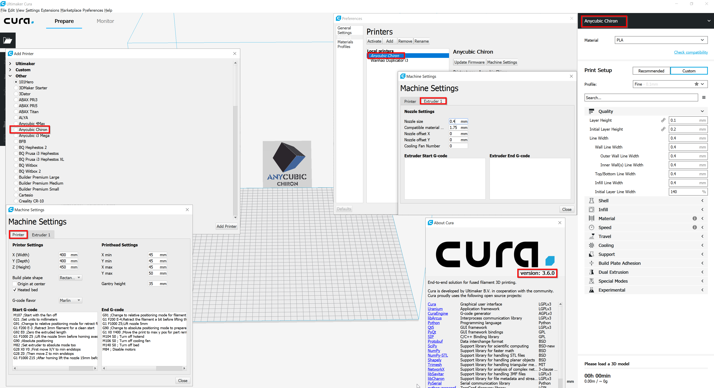

# Anycubic Chiron Cura Definitions  
# and Printer Profiles  
  
Definition files to make the new Anycubic Chiron printer available in Cura 3.6.0 (works also for cura 4.0 BETA)!

How to add the "Anycubic Chiron" printer to Cura 3.6.0:  

1.) Paste all files from "Chiron printer definition files for cura" folders into the appropriate cura resource folder 

    E.g.: Chiron printer definition files for cura\definitions\anycubic_chiron.def.json -> C:\Program Files\Ultimaker Cura 3.6\resources\definitions\
    ... 
    
2.) If needed delete cached "cura" files in C:\Users\yourUserName\AppData\Local\cura 
  
P.S.   
I'm working on some cura profiles which can be downloaded from the "My Cura profiles" folder. 
Note that im still working on these profiles!

Cura 3.6.0. Screenshot

